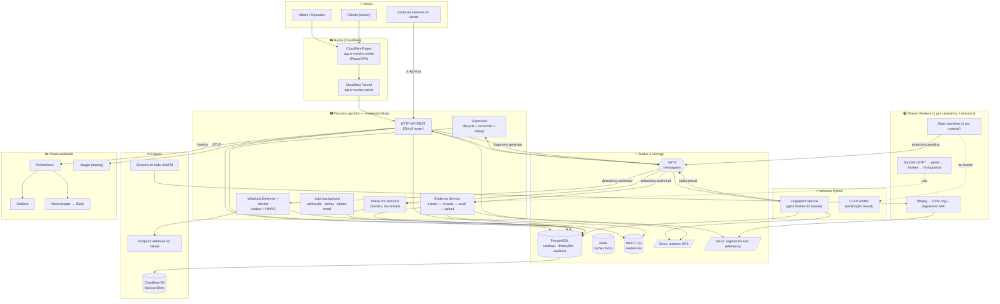
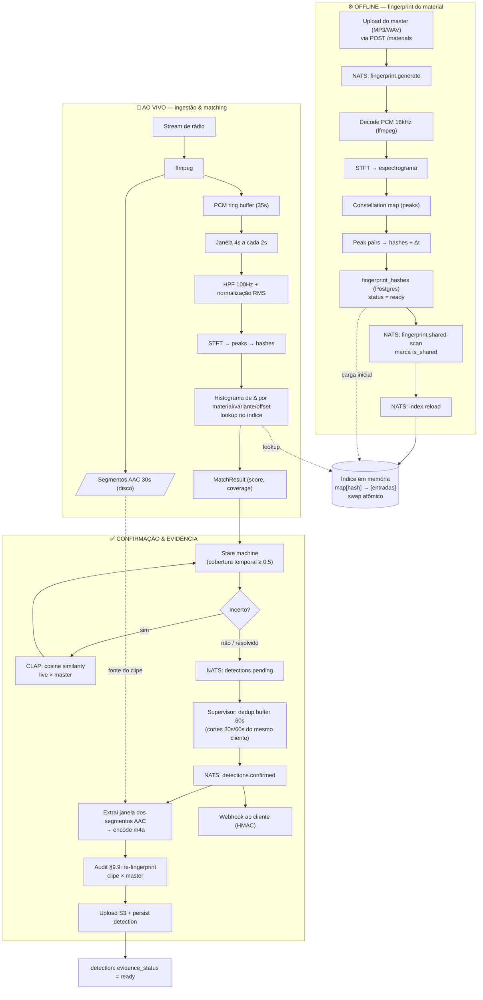
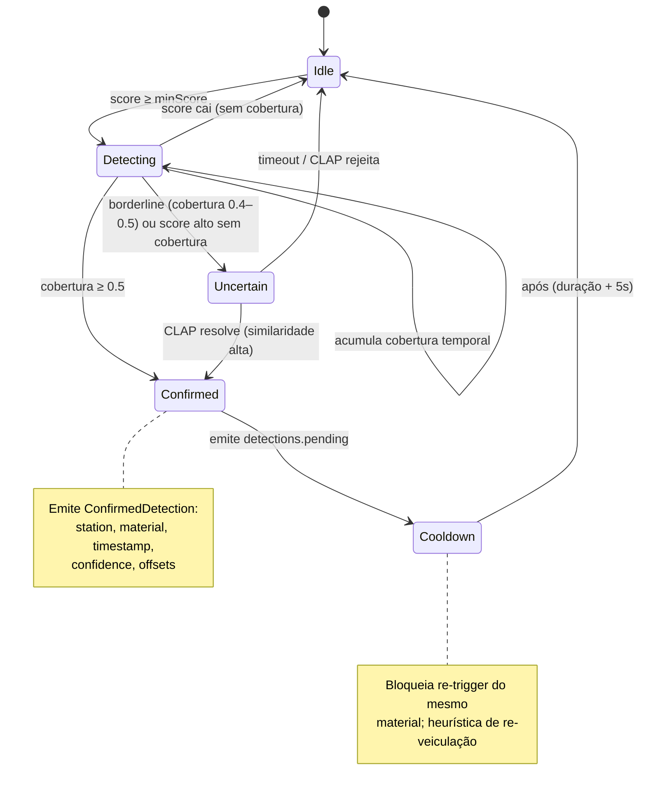
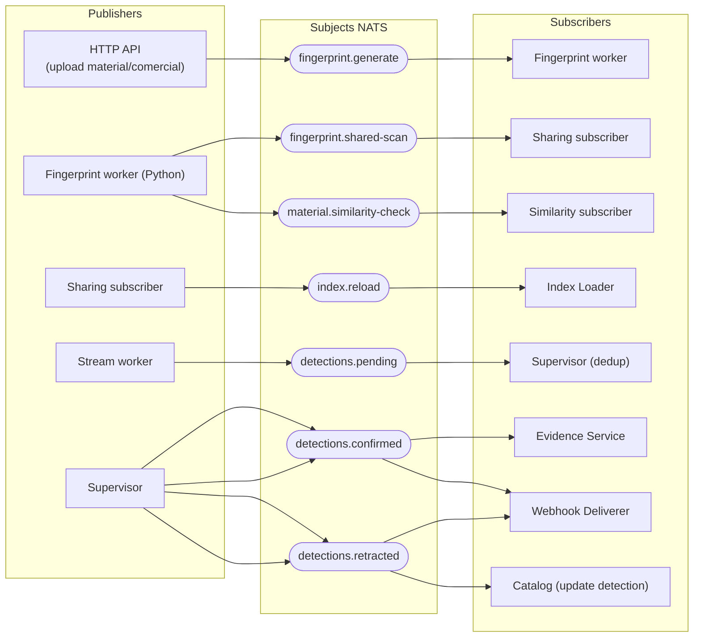
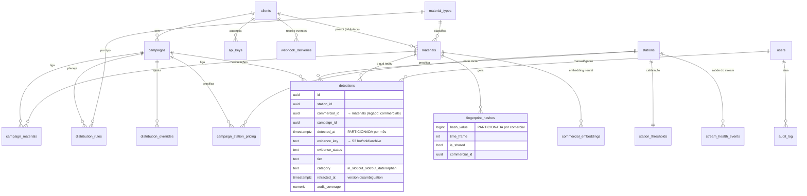
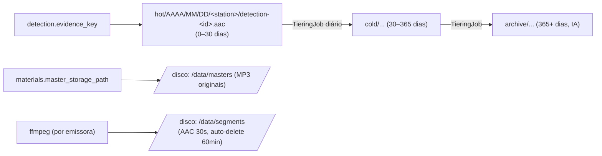
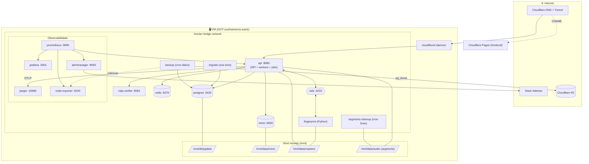
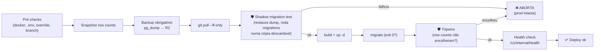
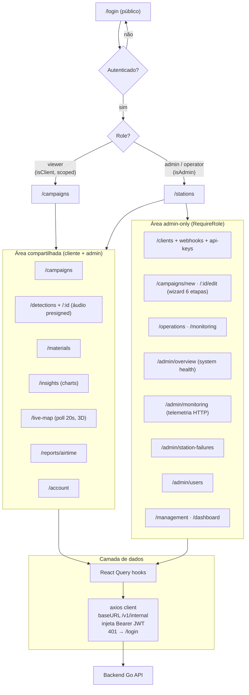

# Arquitetura do Sistema — Fluxogramas

Visão visual de **toda** a arquitetura do Radiocheck/E-monitor. Os diagramas abaixo são [Mermaid](https://mermaid.js.org/) — renderizam no preview de Markdown do VSCode (extensão *Markdown Preview Mermaid Support*) e no GitHub.

Cada diagrama tem um foco. Leia na ordem:

1. [Visão geral](#1-visão-geral-container-view) — o sistema inteiro em uma tela.
2. [Pipeline de detecção](#2-pipeline-de-detecção-o-núcleo) — o coração: do master à veiculação confirmada.
3. [State machine de detecção](#3-state-machine-de-detecção) — como uma janela vira detecção.
4. [Eventos NATS](#4-eventos-nats-mensageria-interna) — a espinha dorsal assíncrona.
5. [Modelo de dados](#5-modelo-de-dados-postgresql--storage) — entidades e relacionamentos.
6. [Topologia de infra](#6-topologia-de-infraestrutura--deploy) — docker-compose, rede, backup, observabilidade.
7. [Frontend](#7-frontend-rotas-e-gating-por-role) — rotas, gating por role, fetch.

> **Fonte arquitetural**: este doc é uma síntese visual. A fonte de verdade continua sendo [plano_implementacao.md](../../plano_implementacao.md) e o código referenciado no header.

---

## 1. Visão geral (container view)

Quem fala com quem, no nível de processo/serviço. O **processo `api` (Go)** hospeda muita coisa além do HTTP: supervisor de workers, índice em memória, serviço de evidência, webhooks e jobs de background.

**Leitura rápida:** o frontend só conversa com o HTTP API. O HTTP API publica trabalho no NATS (fingerprint, índice) e lê/escreve em Postgres + MinIO. Os **stream workers** vivem dentro do mesmo processo `api` (orquestrados pelo Supervisor) e emitem `detections.pending`; o Supervisor deduplica e emite `detections.confirmed`, que dispara evidência + webhook.

---

## 2. Pipeline de detecção (o núcleo)

O caminho completo do áudio: à esquerda o **fluxo offline** (master vira fingerprint); à direita o **fluxo ao vivo** (stream vira veiculação confirmada com evidência).

**Pontos-chave:**
- O índice em memória é o ponto de encontro dos dois fluxos: o offline o **popula** (via `index.reload`), o ao vivo o **consulta** (lookup de hashes).
- A **state machine** só confirma com cobertura temporal suficiente; casos borderline vão pra **verificação neural (CLAP)**.
- A **evidência** é extraída dos segmentos AAC gravados em disco e passa por **audit §9.9** (re-fingerprint do clipe contra o master) antes de virar `ready`.

---

## 3. State machine de detecção

Como cada material monitorado transita de "nada acontecendo" até "veiculação confirmada". Uma state machine por `material_id` por worker.

---

## 4. Eventos NATS (mensageria interna)

Todo o desacoplamento assíncrono passa por aqui. Subjects definidos em [workers/internal/events/nats.go](../../workers/internal/events/nats.go).

> Os nomes exatos dos subjects devem ser confirmados em `events/nats.go` antes de qualquer mudança — alguns evoluíram entre versões (v1 emitia `detections.confirmed` direto do worker; v2 introduziu o estágio `detections.pending` + dedup no supervisor).

---

## 5. Modelo de dados (PostgreSQL + storage)

Entidades centrais e seus relacionamentos. `campaigns`, `detections`, `materials` e `stations` são os hubs que conectam tudo. DDL em [migrations/](../../migrations/).

**Storage de objetos (MinIO/S3)** — bucket único, layout por tier + data:

---

## 6. Topologia de infraestrutura & deploy

Os ~17 serviços do `docker-compose` e como se conectam. Dados críticos usam **bind mount** em prod (sobrevivem a `down -v`). Exposição externa só via Cloudflare Tunnel. Detalhes em [operations/deploy.md](../operations/deploy.md).

**Fluxo de deploy** ([scripts/deploy.sh](../../scripts/deploy.sh)) — gates de segurança nascidos dos incidentes 2026-05-12 e 2026-06-17:

---

## 7. Frontend (rotas e gating por role)

SPA React 19 + Vite/Rolldown. Sem WebSocket — realtime é via *polling* do React Query. Roteamento em [frontend/src/App.jsx](../../frontend/src/App.jsx), fetch em [frontend/src/api/hooks.js](../../frontend/src/api/hooks.js).

**Gating em duas camadas:** rota (`RequireAuth` + `RequireRole`) e UI (`{isAdmin && ...}` em botões). O backend reforça com scope por `client_id` (viewer vê só o próprio cliente, com resposta 404 anti-oracle).

---

## Legenda dos diagramas

| Forma | Significado |
|-------|-------------|
| `[retângulo]` | Processo, serviço ou componente |
| `[(cilindro)]` | Banco de dados / storage persistente |
| `{{hexágono}}` | Message broker (NATS) |
| `[/paralelogramo/]` | Arquivo / volume em disco |
| `{losango}` | Decisão / condição |
| `([estádio])` | Subject NATS / evento |
| seta `-->` | Fluxo de dados / chamada |
| seta `-. tracejada .->` | Relação condicional ou de leitura |
